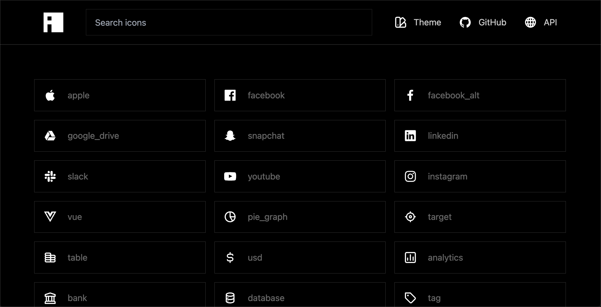

<br />
<div align="center">
  <h1>Toybox</h1>
  <p align="center">
    <a href="https://toybox.design">Components</a>
    &nbsp·&nbsp
    <a href="https://toybox.design/icons">Icons</a>
    &nbsp·&nbsp
    <a href="https://toybox.design/api/v1/icons">API</a>
  </p>
</div>

## About The Project

<!-- 

Working with icons can be a whole thing. You have to find the right icon, download it, and then use it in your project. This is a pain. We want to make it easier for you to use icons in your projects. Iconic aims to make this process easier by providing a simple API to fetch SVGs and render them in your project. -->

### Built With

- [Nuxt](https://nuxt.com/docs/getting-started/introduction)
- [TailwindCSS](https://tailwindcss.com/docs)
- [DaisyUI](https://daisyui.com/components)

## Icons

- You can use the API to fetch icons. The API is available at [toybox.design/api/v1/icons](https://toybox.design/api/v1/icons). The API returns the following JSON:

```json
{
  "name": "icon_name",
  "tags": ["tag1", "tag2", "tag3"],
  "data": "<svg>...</svg>"
}
```

## Example Icon Component (Nuxt)

```vue
<script setup>
const props = defineProps({
  name: {
    type: String,
    default: "",
    requred: true,
  },
  color: {
    type: String,
    default: "",
  },
});

const { data: svg } = api.get(
  `http://iconicui.vercel.app/api/icons/${props.name}`
);
</script>

<template>
  <div
    v-html="svg"
    :style="`${props.color ? `color: ${props.color}` : ''}`"
  ></div>
</template>
```
